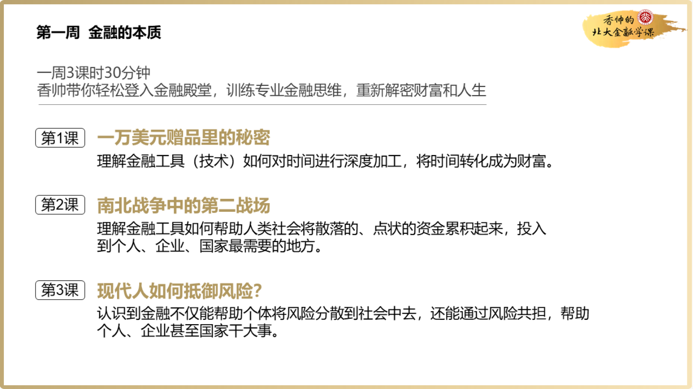
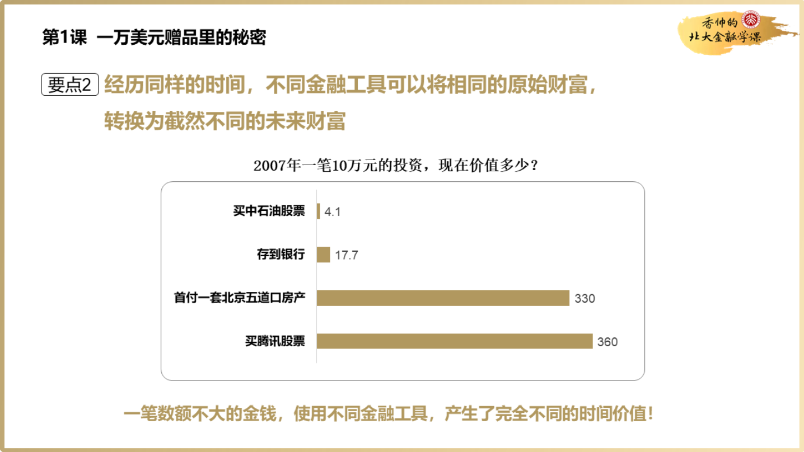

- # 香帅的北大金融学  

- [金融世界观](#金融世界观)
  - [金融的本质](#金融的本质)
    - [1 资金的时间价值](#1-资金的时间价值)
    - [2 资金的集聚](#2-资金的集聚)

## 金融世界观
### 金融的本质
我们本周的主题是`金融的本质`，它是构建你的金融世界观的第一块基石。这三天我分别从`时间`、`资金`、`风险`三个维度给你讲解了金融的作用，我将它们称为`金融的三大定理`  

    </img>

#### 1 资金的时间价值

首先我讲了一个故事，一个经销商号称给你`１万美金`的赠品，但是这个赠品是30年后兑现的一万美金，折算到今天，其实只有`994`美金（按照8%的利率）。30年的时间被折算成了994美金，这就是金融里最基础的概念——时间的价值。 **金融就是帮助我们人类对未来时间进行深度加工，将时间转化成不同财富的技术和工具。**  

接着我告诉你，金融这种深度加工时间的能力会对我们的生活造成什么影响：两个人有同样的初始财富，选择不同的金融工具，十年之后他们的财富能达到百倍之差，人生处境也会有很大不同。**这就是金融的第一定理——时间的价值。**  

    </img>

    </img>

#### 2 资金的集聚

除了时间的约束之外，人类面临的另一约束是资金约束。现代金融就是帮助人们在关键时刻集聚资金的技术。从个人结婚、买房、生病、留学，到企业的建设、研发、投资，都是金融在帮我们实现资金的集聚。即使是那些看上去和金融无关的事物，比如战争和城市兴衰，背后都是资金的翻云覆雨手。

这节课我给你讲了两个小案例，一个是美国南北战争，北方的债券发行帮助北方战胜了南方。另一个是美国纽约的兴起是因为伊利运河的成功修建。然而，如果没有债券、股票这样的金融工具实现快速的大规模筹资，伊利运河就不可能修建起来。如果没有金融工具，我们看到的历史会是完全不同的模样，这就是金融的第二定理——资金的集聚

