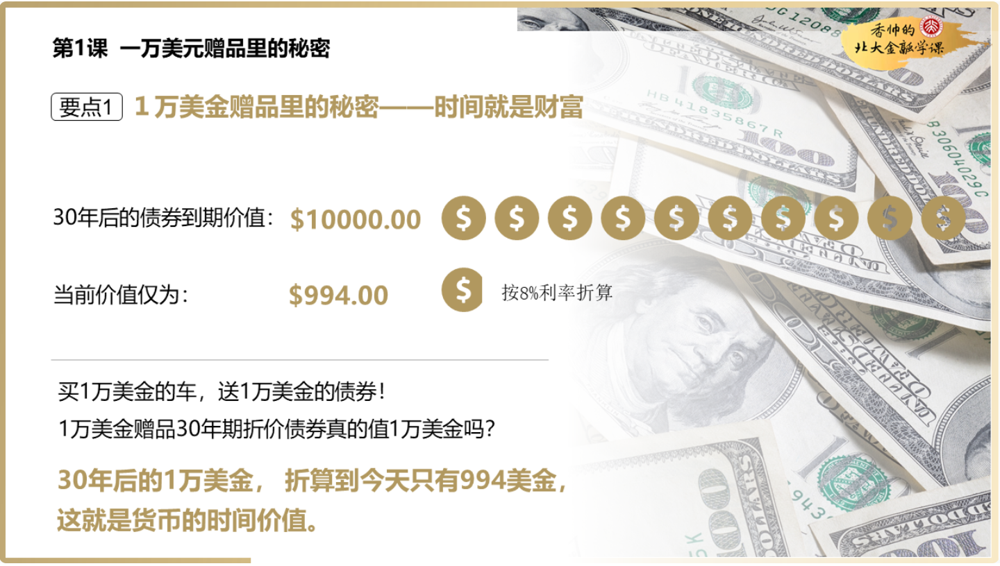
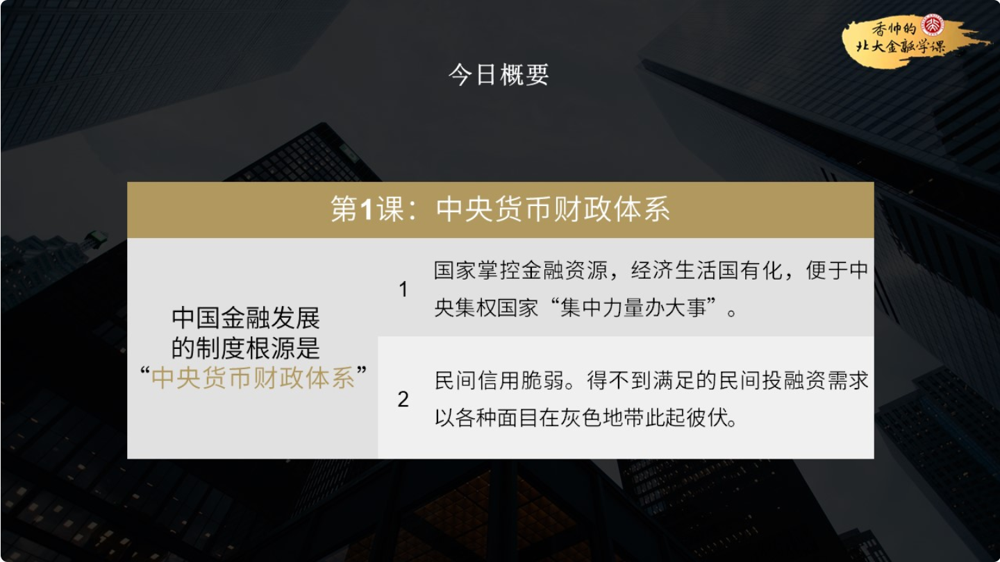

- # 香帅的北大金融学  

## 目录
- [目录](#目录)
- [金融世界观](#金融世界观)
  - [金融的本质](#金融的本质)
    - [资金的时间价值](#资金的时间价值)
    - [资金的集聚](#资金的集聚)
    - [风险的共担](#风险的共担)
  - [金融的演化](#金融的演化)
    - [王的信用：中央货币财政体系](#王的信用中央货币财政体系)
    - [分权制衡：银行货币信用体系](#分权制衡银行货币信用体系)
    - [金融市场的特征：信息不对称](#金融市场的特征信息不对称)
- [银行·现代社会运行的血管](#银行现代社会运行的血管)
  - [货币与信用](#货币与信用)

## 金融世界观
### 金融的本质
我们本周的主题是`金融的本质`，它是构建你的金融世界观的第一块基石。这三天我分别从`时间`、`资金`、`风险`三个维度给你讲解了金融的作用，我将它们称为`金融的三大定理`  

    </img>

[:books: 返回目录](#目录)

#### 资金的时间价值

首先我讲了一个故事，一个经销商号称给你`１万美金`的赠品，但是这个赠品是30年后兑现的一万美金，折算到今天，其实只有`994`美金（按照8%的利率）。30年的时间被折算成了994美金，这就是金融里最基础的概念——时间的价值。 **金融就是帮助我们人类对未来时间进行深度加工，将时间转化成不同财富的技术和工具。**  

接着我告诉你，金融这种深度加工时间的能力会对我们的生活造成什么影响：两个人有同样的初始财富，选择不同的金融工具，十年之后他们的财富能达到百倍之差，人生处境也会有很大不同。**这就是金融的第一定理——时间的价值。**  

    </img>

 

    </img>

[:books: 返回目录](#目录)

#### 资金的集聚

除了时间的约束之外，人类面临的另一约束是资金约束。现代金融就是帮助人们在关键时刻集聚资金的技术。从个人结婚、买房、生病、留学，到企业的建设、研发、投资，都是金融在帮我们实现资金的集聚。即使是那些看上去和金融无关的事物，比如战争和城市兴衰，背后都是资金的翻云覆雨手。

这节课我给你讲了两个小案例，一个是美国南北战争，北方的债券发行帮助北方战胜了南方。另一个是美国纽约的兴起是因为伊利运河的成功修建。然而，如果没有债券、股票这样的金融工具实现快速的大规模筹资，伊利运河就不可能修建起来。如果没有金融工具，我们看到的历史会是完全不同的模样，这就是金融的第二定理——资金的集聚

 

    </img>

 

    </img>

 

    </img>

[:books: 返回目录](#目录)
#### 风险的共担

第三天，你要了解的是金融的第三定理——`风险分担`。风险是人类面临的永恒问题，个体无法承受过大的系统性风险，而金融技术就帮助人类进行了跨地区、跨时间的风险分担活动。我们讲了三个小案例：

1）农业保险帮助美国农民分担了旱灾的风险，农民尽管颗粒无收，但收入不降反升；

2）股票帮助17世纪的荷兰东印度公司分担了海上贸易的风险，使得荷兰成为那个时代最强大的海上帝国；

3）风投资金帮助创业者进行风险分担，特斯拉创始人马斯克的火箭发射就是在风投支持下成功的，谷歌、阿里巴巴、腾讯这些企业背后都有风投的影子。  

 

    </img>

 

    </img>

 

    </img>

[:books: 返回目录](#目录)
### 金融的演化  

本周我们的主题叫`金融的演化`。任何金融市场都是历史大环境的产物。中国和欧美的历史大背景决定了这两种现代金融市场演化的路径和方向都很不同。这周的前两天我介绍了中国和欧美金融制度不同的起源和演化路径，第三天我们重点强调金融市场都具有的关键性特征——`信息不对称`。

 

    </img>

[:books: 返回目录](#目录)
#### 王的信用：中央货币财政体系

**第一天的重点是中国金融市场的制度根源：秦汉时代开始的中央集权与“官山海”的国有经济制度，是中国金融制度的根源，我们称其为“中央货币财政体系”。**

这种制度确实有其优越性，比如，能集中国家资源，统一市场，促进商业流通，这也是我们中国的货币经济在早期一直处于世界领先地位的重要原因。 但是这种制度的弊端也是特别明显的，其中最重要的就是**民间信用脆弱**。

 

    </img>

现代以后，尽管经历了不同的经济形态，但是这种“国家控制金融资源”的思路一直没有发生根本改变：比如说A股市场的设立就是为了“替国有企业解困”；比如说银行存款利率被严重压低，就是用来支持国家扶持的行业和企业。和历史一样，这种中央控制大量资源的制度设计虽然能够“集中力量办大事”，但也同样造成了民间信用脆弱的毛病， 所以中国民间的金融需求被压抑，以各种面目（非法集资，互联网金融，各种资产泡沫）在灰色地带此起彼伏。

 

    </img>

 

    </img>

[:books: 返回目录](#目录)

#### 分权制衡：银行货币信用体系
现代欧美发达的金融市场是怎么发展起来的呢？是从一个叫“圣殿骑士团”的机构起步的。他们一开始做财务托管和货币兑换的生意，后来慢慢从事储蓄理财业务，扮演起银行的角色，奠定了整个欧洲的金融基础。 

 

    </img>

在骑士团衰落之后，欧洲其他信用机构逐渐形成以银行为中心的、分权制衡下的信用体系。而美国也凭借着自己独特的地理环境和政治环境形成了“分权制衡”的行政体制和信用网络，延续了欧洲的金融传统。

 

    </img>

 

    </img>

 

    </img>

 

    </img>

[:books: 返回目录](#目录)
#### 金融市场的特征：信息不对称

**第三天，你要了解的是金融市场最重要的特征——信息不对称。**

因为金融市场交易的是看不见、摸不着的东西，所以天生是信息不对称的重灾区。所以消除信息不对称的“中介机构”在金融市场上就显得非常重要。

 

    </img>

 

    </img>

我们讲了两个非常重要的金融中介:  
1. 银行需要对借贷者的信用情况进行调查，由此降低了贷款过程中的信息不对称；  
2. 投资银行在财务、法律等方面非常专业，能够在企业上市、并购的过程中降低信息不对称。同时，信用评级机构等中介机构也在信息披露方面发挥着重要作用

 

    </img>

 

    </img>

 

    </img>

## 银行·现代社会运行的血管  
### 货币与信用

[:books: 返回目录](#目录)

